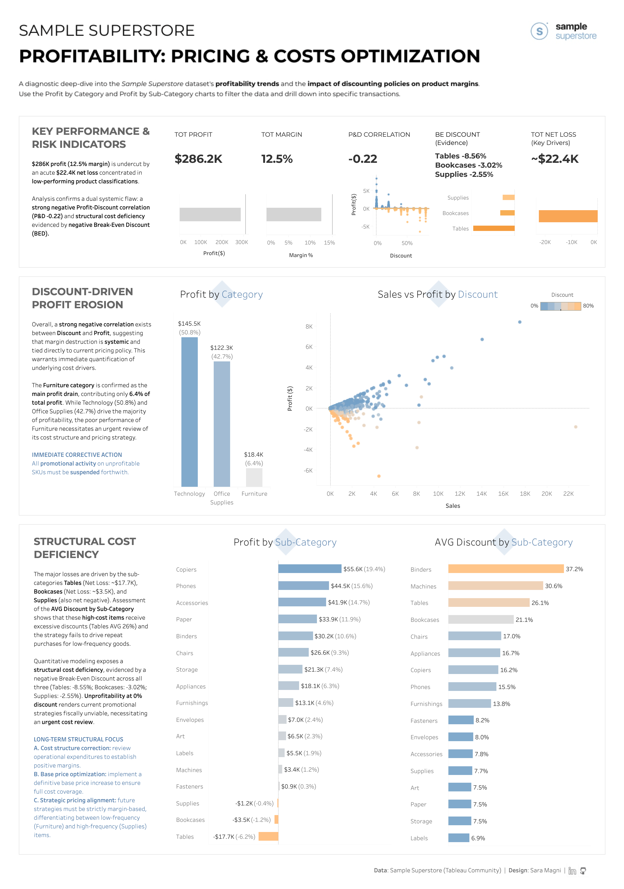

# Sample Superstore | Profitability: Pricing & Cost Optimization

This project analyzes the profitability of the *Sample Superstore* dataset with a dedicated focus on **pricing**, **discounting behavior**, and **loss drivers**.
The goal is to **uncover non‑obvious patterns that impact margins** and provide **actionable, data‑driven recommendations** for business decision‑makers.

The work integrates:

- Exploratory data analysis (**EDA**).

- **Profitability metrics**.

- **Break‑even discount calculations**.

- Identification of **loss‑making categories and products**.

- An **interactive Tableau dashboard** designed for strategic insights.

## **Project Objectives**

## Main Goal
Understand **why** certain categories and products generate losses and **how** pricing and discounts influence overall profitability.

## Specific Objectives
- Analyze the relationship between **discount levels** and **profit**.

- Identify categories, sub‑categories, and SKUs with negative margins.

- Compute the **break‑even discount** to assess promotion sustainability.

- Highlight recurring patterns that drive losses across segments.

- Provide clear, business‑oriented recommendations.

## **Methodology**

## Data Preparation

- Standardized column names and data types.

- Removed inconsistencies and duplicates.

- Validated profit, cost, and discount calculations.

- Created additional fields for profitability analysis.

## Profitability Analysis

- Profit ratio and contribution margin.

- Discount impact analysis.

- Loss concentration by category, sub‑category, and region.

- SKU‑level deep dive to identify structural issues.

## Break‑Even Discount Calculation
For each product, the break‑even discount was computed to determine the maximum discount that still preserves profitability.

This metric highlights:

- Products that cannot sustain any discount.

- Categories where promotions systematically destroy margin.

- Opportunities for pricing optimization.

## **Interactive Dashboard (Tableau Public)**
The analysis is supported by an interactive dashboard for executive and operational monitoring.

It includes:

- Profitability overview.

- Discount analysis.

- Category and product drill‑downs.

- Loss driver identification.

*Click the image above to explore the interactive visualizations and the implementation checklist.*

## **Key Insights & Recommendations (Executive Summary)**

### INSIGHTS ###

Profit erosion is centered on the **Furniture** category, contributing only 6% of the total company profit. 

The major losses are driven by the sub-categories **Tables** (Net Loss: ~$17.7K), **Bookcases** (Net Loss: ~$3.5K), and **Supplies** (also net negative).

The problem is two-fold:

- **High-cost items receive excessive discounts** (Tables AVG 26%) and the strategy fails to drive repeat purchases for low-frequency goods.
- Quantitative analysis confirms a **structural cost issue**, as these loss-drivers show a **negative Break-Even Discount** (meaning they lose money even at a 0% discount).

### RECOMMENDATIONS ###

- **Immediate Corrective Action:** All promotional activity on unprofitable SKUs must be suspended forthwith.

- **Long-term structural focus:**

    A. *Cost structure correction*: Review operational expenditures to establish positive margins.

    B. *Base price optimization*: Implement a definitive base price increase to ensure full cost coverage.

    C. *Strategic pricing alignment*: Future strategies must be strictly margin-based, differentiating between low-frequency (Furniture) and high-frequency (Supplies) items.

## **Tech Stack**
- **Data:** Sample Superstore Dataset (sample_superstore.csv and sample_superstore_cleaned.csv).

- **Analysis & ETL:** Python / Jupyter Notebook (sample_superstore_profitability.ipynb).

- **Visualization:** Tableau Desktop (Workbook: sample_superstore_profitability.twbx).

## **Notes**
- The dataset is synthetic and does not represent real business operations.

- Operational costs, marketing spend, and customer lifetime value are not included.

- The analysis focuses on transactional profitability, not long‑term strategic value.

## Author

**Sara Magni**  
*Data Analyst*

[sara.m4gn1.data@gmail.com](mailto:sara.m4gn1.data@gmail.com) | [LinkedIn](https://www.linkedin.com/in/sara-m4gn1/) | [GitHub](https://github.com/Sara-Magni)

---

*Every metric is grounded in data, every recommendation is testable, and every visualization tells a story.*